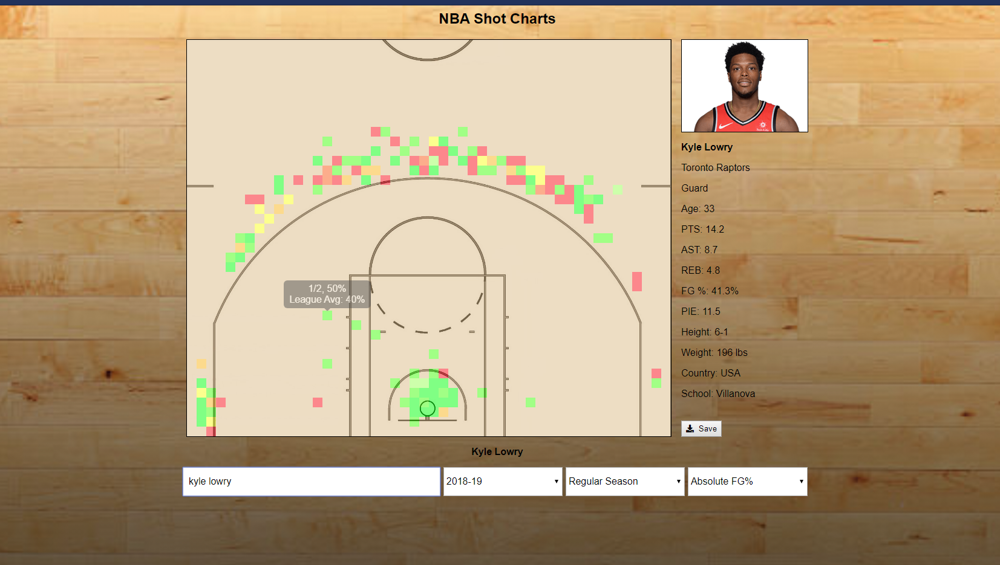

# shot-charts



Note: Unfortunately the API used for this is no longer working, so the project has lost functionality.

Search for both NBA player and team shot charts. Option to select the season and regular season or playoffs. Can also choose from 3 different shot chart types (absolute FG%, relative FG%, and shot frequency). Able to save and download shot charts.

Built with:
 * Javascript, Node, Express, jQuery
 * The nba npm module (https://www.npmjs.com/package/nba) for raw shot data and statistics

To run locally:

```$ git clone https://github.com/rileythomp/shot-charts.git```

```$ cd shot-charts```

```$ npm i```

```$ npm start```

Then go to localhost:3000 in a browser.
